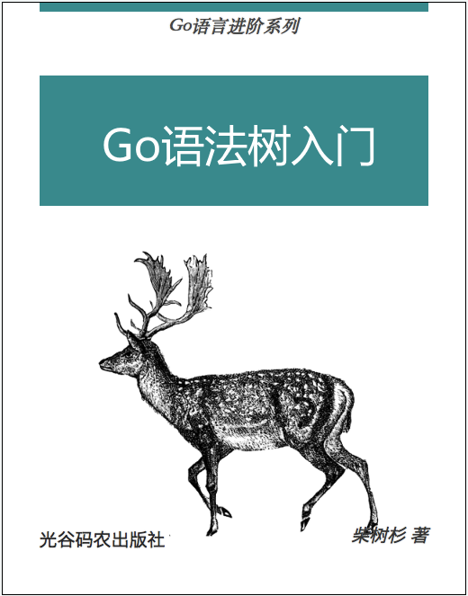
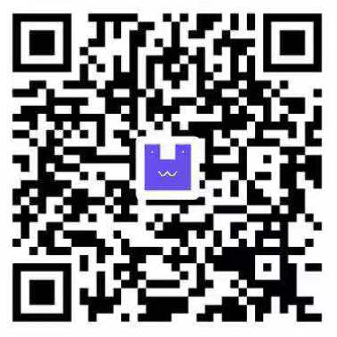

# Go语法树入门——开启自制编程语言和编译器之旅！

- *Go语言QQ群: 102319854, 1055927514*
- *光谷码农课堂: https://study.163.com/provider/480000001914454/index.htm*
- *凹语言(凹读音“Wa”)(The Wa Programming Language): https://github.com/wa-lang/wa*

----

**蚂蚁金服招聘云原生方向和编程语言方向岗位(杭州/P7)：云原生方向要求熟悉k8s配套工具，如kubectl、kustomize、kubebuilder，operator；编程语言方向要求对语言对语言解释器（如py/js/lua/wasm等）、工具链、配套SDK有一定兴趣和实践经验。欢迎各位同学咨询或推荐（推荐成功独享全额推荐红包）。联系方式 chaishushan@gmail.com, shushan.css@alibaba-inc.com**

----

Go语法树是Go语言源文件的另一种语义等价的表现形式。而Go语言自带的`go fmt`和`go doc`等命令都是在Go语法树的基础之上分析工具。因此将Go语言程序作为输入数据，让我们语法树这个维度重新审视Go语言程序，我们将得到创建Go语言本身的技术。Go语法树由标准库的`go/ast`包定义，它是在`go/token`包定义的词法基础只是抽象的语法树结构。本书简单介绍语法树相关包的使用（出版社已经约稿出版本书，并在开源版本的基础之上增加了语义信息、SSA形式、LLVM和凹语言等内容，因为出版社版权问题不方便全部公开新增内容）。

- 作者：柴树杉，Github [@chai2010](https://github.com/chai2010)，Twitter [@chaishushan](https://twitter.com/chaishushan)
- 作者：史斌，Github [@benshi001](https://github.com/benshi001)
- 作者：丁尔男，Github [@3dgen](https://github.com/3dgen)
- 主页：https://github.com/chai2010/go-ast-book

# 在线阅读

* [第1章 记号](ch1/readme.md)
* [第2章 基础面值](ch2/readme.md)
* [第3章 基础表达式](ch3/readme.md)
* [第4章 代码结构](ch4/readme.md)
* [第5章 通用声明](ch5/readme.md)
* [第6章 函数声明](ch6/readme.md)
* [第7章 复合类型](ch7/readme.md)
* [第8章 复合面值](ch8/readme.md)
* [第9章 复合表达式](ch9/readme.md)
* [第10章 语句块和语句](ch10/readme.md)
* [第11章 类型检查](ch11/readme.md)
* [第12章 凹语言(TODO)](ch12/readme.md)
* [附录A goyacc](appendix/a-goyacc/readme.md)

<!--
## 购买电子版（20元）

该电子书仅授权在Github网站免费阅读，如需离线下载请购买电子版。

| 支付宝 | 微信 |
|:-----:|:-----:|
|||
-->

# 版权

版权 [柴树杉](https://github.com/chai2010)、[史斌](https://github.com/benshi001)和[丁尔男](https://github.com/3dgen)，保留相关权力。针对Github注册用户提供以下的优惠权利：

1. Github平台免费在线阅读。
1. 关注本书项目(Star)，同时关注任意一个作者的 Github 或 推特账号，自动获得下载的权利。

**禁止非 Github 平台转载，作者保留相关法律权利。**
