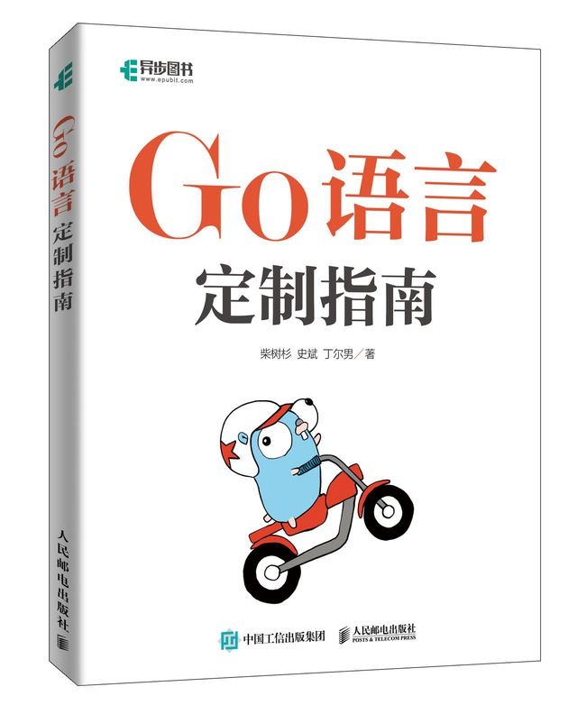

# 《Go语言定制指南》（原名：Go语法树入门）

- *KusonStack一站式可编程配置技术栈: https://github.com/KusionStack/kusion*
- *KCL配置编程语言: https://github.com/KusionStack/KCLVM*

---

Go语法树是Go语言源文件的另一种语义等价的表现形式。而Go语言自带的`go fmt`和`go doc`等命令都是在Go语法树的基础之上分析工具。因此将Go语言程序作为输入数据，让我们语法树这个维度重新审视Go语言程序，我们将得到创建Go语言本身的技术。Go语法树由标准库的`go/ast`包定义，它是在`go/token`包定义的词法基础之上抽象的语法树结构。本书简单介绍语法树相关包的使用。如果想从头实现一个玩具Go语言可以参考[《从头实现µGo语言》](https://github.com/chai2010/ugo-compiler-book)。

---

- 作者：柴树杉，Github [@chai2010](https://github.com/chai2010)，Twitter [@chaishushan](https://twitter.com/chaishushan)
- 作者：史斌，Github [@benshi001](https://github.com/benshi001)
- 作者：丁尔男，Github [@3dgen](https://github.com/3dgen)
- 主页：[https://github.com/chai2010/go-ast-book](https://github.com/chai2010/go-ast-book)
- 阅读：[https://chai2010.cn/go-ast-book](https://chai2010.cn/go-ast-book)

## 购买链接：

- 京东：[https://item.jd.com/13698866.html](https://item.jd.com/13698866.html)
- 当当：[https://product.dangdang.com/29388202.html](https://product.dangdang.com/29388202.html)
- 异步：[https://www.epubit.com/bookDetails?id=UBc86f749c1eb7](https://www.epubit.com/bookDetails?id=UBc86f749c1eb7)

如果你喜欢本书，欢迎到豆瓣评论：

- [https://book.douban.com/subject/35852237](https://book.douban.com/subject/35852237)

# 微信公众号

# 版权

版权 [柴树杉](https://github.com/chai2010)、[史斌](https://github.com/benshi001)和[丁尔男](https://github.com/3dgen)，保留相关权力。此内容仅针对Github平台用户免费在线阅读。
