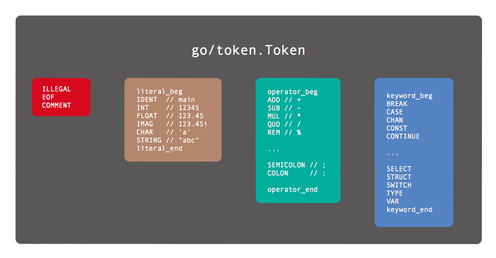
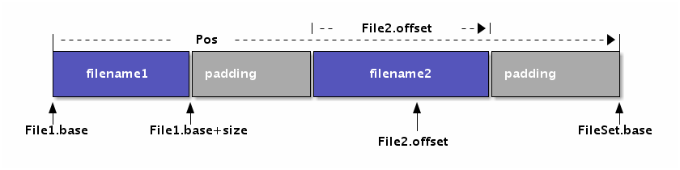

# 第1章 Token

Token是编程语言中最小的具有独立含义的词法单元。Token不仅仅包含关键字，还包含用户自定义的标识符、运算符、分隔符和注释等。每个Token对应的词法单元有三个属性是比较重要的：首先是Token本身的值表示词法单元的类型，其次是Token在源代码中源代码文本形式，最后是Token出现的位置。在所有的Token中，注释和分号是两种比较特殊的Token：普通的注释一般不影响程序的语义，因此很多时候可以忽略注释；而Go语言中经常在行尾自动添加分号Token，而分号是分隔语句的词法单元，因此自动添加分号导致了Go语言左花括弧不能单独一行等细微的语法差异。本章学习如何对源代码进行Token分析。

## 1.1 Token语法

Go语言中主要有标识符、关键字、运算符和分隔符等类型等Token组成。其中标识符的语法定义如下：

```bnf
identifier = letter { letter | unicode_digit } .
letter     = unicode_letter | "_" .
```

其中identifier表示标识符，由字母和数字组成，开头第一个字符必须是字母。需要注意的是下划线也是作为字母，因此可以用下划线作为标识符。不过美元符号`$`并不属于字母，因此标识符中不能包含美元符号。

在标识符中有一类特殊的标识符被定义为关键字。关键字用于引导特殊的语法结构，不能将关键字作为独立的标识符（）。下面是Go语言定义的25个关键字：

```go
break        default      func         interface    select
case         defer        go           map          struct
chan         else         goto         package      switch
const        fallthrough  if           range        type
continue     for          import       return       var
```

除了标识符和关键字，Token还包含运算符和分隔符。下面是Go语言定义的47个符号：

```
+    &     +=    &=     &&    ==    !=    (    )
-    |     -=    |=     ||    <     <=    [    ]
*    ^     *=    ^=     <-    >     >=    {    }
/    <<    /=    <<=    ++    =     :=    ,    ;
%    >>    %=    >>=    --    !     ...   .    :
     &^          &^=
```

当然，除了用户自定义的标识符、25个关键字、47个运算和分隔符号，程序中还有一些面值、注释和空白符组成。要解析一个Go语言程序，第一步就是要解析这些Token。

## 1.2 Token的定义

在`go/token`包中，Token被定义为一种枚举值，不同值的Token表示不同类型的词法记号：

```go
// Token is the set of lexical tokens of the Go programming language.
type Token int
```

所有的Token被分为四类：特殊类型的Token、基础面值对应的Token、运算符Token和关键字。



特殊类型的Token有错误、文件结束和注释三种：

```go
// The list of tokens.
const (
	// Special tokens
	ILLEGAL Token = iota
	EOF
	COMMENT
```

遇到不能识别的Token统一返回ILLEGAL，这样可以简化词法分析时的错误处理。

然后是基础面值对应的Token类型：Go语言规范定义的基础面值主要有整数、浮点数和复数面值类型，此外还有字符和字符串面值类型。需要注意的是，在Go语言规范中布尔类型的true和false并不在基础面值之类。但是为了方便词法解析，`go/token`包将true和false等对应的标识符也作为面值Token一类。

下面是面值类Token列表：

```go
	literal_beg
	// Identifiers and basic type literals
	// (these tokens stand for classes of literals)
	IDENT  // main
	INT    // 12345
	FLOAT  // 123.45
	IMAG   // 123.45i
	CHAR   // 'a'
	STRING // "abc"
	literal_end
```

其中literal_beg和literal_end是私有的类型，主要用于表示面值类型Token的值域范围，因此判断一个Token的值在literal_beg和literal_end之间就可以确定是面值类型。

运算符和分隔符符类型的Token数量最多，下面Token列表：

```go
	operator_beg
	// Operators and delimiters
	ADD // +
	SUB // -
	MUL // *
	QUO // /
	REM // %

	AND     // &
	OR      // |
	XOR     // ^
	SHL     // <<
	SHR     // >>
	AND_NOT // &^

	ADD_ASSIGN // +=
	SUB_ASSIGN // -=
	MUL_ASSIGN // *=
	QUO_ASSIGN // /=
	REM_ASSIGN // %=

	AND_ASSIGN     // &=
	OR_ASSIGN      // |=
	XOR_ASSIGN     // ^=
	SHL_ASSIGN     // <<=
	SHR_ASSIGN     // >>=
	AND_NOT_ASSIGN // &^=

	LAND  // &&
	LOR   // ||
	ARROW // <-
	INC   // ++
	DEC   // --

	EQL    // ==
	LSS    // <
	GTR    // >
	ASSIGN // =
	NOT    // !

	NEQ      // !=
	LEQ      // <=
	GEQ      // >=
	DEFINE   // :=
	ELLIPSIS // ...

	LPAREN // (
	LBRACK // [
	LBRACE // {
	COMMA  // ,
	PERIOD // .

	RPAREN    // )
	RBRACK    // ]
	RBRACE    // }
	SEMICOLON // ;
	COLON     // :
	operator_end
```

运算符主要有普通的加减乘除等算术运算符号，此外还有逻辑运算、位运算符和比较运算等二元运算（其中二元运算还和赋值运算再次组合）。除了二元运算之外，还有少量的一元运算符号：比如正负号、取地址符号、管道的读取等。而分隔符主要是小括弧、中括弧、大括弧，以及逗号、点号、分号和冒号组成。

而Go语言的关键字刚好对应25个关键字类型的Token：

```
	keyword_beg
	// Keywords
	BREAK
	CASE
	CHAN
	CONST
	CONTINUE

	DEFAULT
	DEFER
	ELSE
	FALLTHROUGH
	FOR

	FUNC
	GO
	GOTO
	IF
	IMPORT

	INTERFACE
	MAP
	PACKAGE
	RANGE
	RETURN

	SELECT
	STRUCT
	SWITCH
	TYPE
	VAR
	keyword_end
)
```

从词法分析角度看，关键字和普通的标识符并无差别。但是25个关键字一般都是不同语法结构的开头Token，通过将这些特殊的Token定义为关键字可以简化语法解析的工作。

Token对于编程语言而言就像26个字母对于英文一样重要，它是组成更复杂的逻辑代码的基础单元，因此我们需要熟悉Token的特性和分类。

## 1.3 FileSet和File

在定义Token之后，其实我们可以通过手工方式对源代码进行简单的词法分析了。不过如果希望以后能够复用词法分析的代码，则需要小心设计和源代码部分相关的接口。参考Go语言本身，它是由多个文件组成包，然后多个包链接为一个可执行文件，所以单个包对应的多个文件可以看作是Go语言的基本编译单元。因此`go/token`包还定义了FileSet和File对象，用于描述文件集和文件。

FileSet和File对象的对应关系如图所示：




每个FileSet表示一个文件集合，底层抽象为一个一维数组，而Pos类型表示数组的下标位置。FileSet中的每个File元素对应底层数组的一个区间，不同的File之间没有交集，相邻的File之间可能存在填充空间。

而每个File主要由文件名、base和size三个信息组成。其中base对应File在FileSet中的Pos索引位置，因此base和base+size定义了File在FileSet数组中的开始和结束位置。在每个File内部可以通过offset定位下标索引，通过offset+File.base可以将File内部的offset转换为Pos位置。因为Pos是FileSet的全局偏移量，反之也可以通过Pos查询对应的File，以及对应File内部的offset。

而词法分析的每个Token位置信息就是由Pos定义，通过Pos和对应的FileSet可以轻松查询到对应的File。然后在通过File对应的源文件和offset计算出对应的行号和列号（实现中File只是保存了每行的开始位置，并没有包含原始的源代码数据）。Pos底层是int类型，它和指针的语义类似，因此0也类似空指针被定义为NoPos，表示无效的Pos。

## 1.4 解析Token

Go语言标准库`go/scanner`包提供了Scanner实现Token扫描，它是在FileSet和File抽象文件集合基础上进行词法分析。

scanner.Scanner的公开接口定义如下：

```go
type Scanner struct {
	// public state - ok to modify
	ErrorCount int // number of errors encountered
	// Has unexported fields.
}

func (s *Scanner) Init(
	file *token.File, src []byte,
	err ErrorHandler, mode Mode,
)
func (s *Scanner) Scan() (
	pos token.Pos, tok token.Token, lit string,
)
```

Init方法用于初始化扫描器，其中file参数表示当前的文件（不包含代码数据），src参数表示要分析的代码，err是用户自定义的错误处理函数，mode可以控制是否扫描注释部分。

Scan方法扫描一个Token，三个返回值分别表示Token的位置
、Token值和Token的源代码文本表示。

要构造一个最简单的词法扫描器测试程序，首先要构造Init方法第一参数需要的File对象。但是File对象没有公开的构造函数，只能通过FileSet的AddFile方法间接构造File对象。

下面是一个简单的词法分析程序：

```go
package main

import (
	"fmt"
	"go/scanner"
	"go/token"
)

func main() {
	var src = []byte(`println("你好，世界")`)

	var fset = token.NewFileSet()
	var file = fset.AddFile("hello.go", fset.Base(), len(src))

	var s scanner.Scanner
	s.Init(file, src, nil, scanner.ScanComments)

	for {
		pos, tok, lit := s.Scan()
		if tok == token.EOF {
			break
		}
		fmt.Printf("%s\t%s\t%q\n", fset.Position(pos), tok, lit)
	}
}
```

其中src是要分析的代码。然后通过`token.NewFileSet()`创建一个文件集，Token的位置信息必须通过文件集定位，并且需要通过文件集创建扫描器的Init方法需要的File参数。

然后的`fset.AddFile`方法调用向fset文件集添加一个新的文件，文件名为“hello.go”，文件的长度就是src要分析代码的长度。

然后创建scanner.Scanner对象，并且调用Init方法初始化扫描器。Init的第一个参数就是刚刚添加到fset的文件对象，第二个参数是要分析的代码，第三个nil参数表示没有自定义的错误处理函数，最后的scanner.ScanComments参数表示不用忽略注释Token。

因为要解析的代码中有多个Token，因此我们在一个for循环调用`s.Scan()`依次解析新的Token。如果返回的是token.EOF表示扫描到了文件末尾，否则打印扫描返回的结果。打印前，我们需要将扫描器返回的pos参数转换为更详细的带文件名和行列号的位置信息，可以通过`fset.Position(pos)`方法完成。

以上程序运行的输出如下：

```
hello.go:1:1    IDENT   "println"
hello.go:1:8    (       ""
hello.go:1:9    STRING  "\"你好，世界\""
hello.go:1:26   )       ""
hello.go:1:27   ;       "\n"
```

输出结果的第一列表示Token所在的文件和行列号，中间一列表示Token的值，最后一列表示Token对应的面值。

## 1.5 Position位置信息

`go/token`包的Position表示更详细的位置信息，被定义为一个结构体：

```go
type Position struct {
	Filename string // filename, if any
	Offset   int    // offset, starting at 0
	Line     int    // line number, starting at 1
	Column   int    // column number, starting at 1 (byte count)
}
```

Filename表示文件名，Offset对应文件内的字节偏移量（从0开始），Line和Column对应行列号（从1开始）。比较特殊的是Offset成员，它用于从文件数据定位代码，但是输出时会将偏移量转换为行列号输出。

打印位置信息时，根据文件名、行号和列号有6种组合：

```go
func main() {
	a := token.Position{Filename: "hello.go", Line: 1, Column: 2}
	b := token.Position{Filename: "hello.go", Line: 1}
	c := token.Position{Filename: "hello.go"}

	d := token.Position{Line: 1, Column: 2}
	e := token.Position{Line: 1}
	f := token.Position{Column: 2}

	fmt.Println(a.String())
	fmt.Println(b.String())
	fmt.Println(c.String())
	fmt.Println(d.String())
	fmt.Println(e.String())
	fmt.Println(f.String())
}
```

输出的格式如下：

```
hello.go:1:2
hello.go:1
hello.go
1:2
1
-
```

行号从1开始，是必须的信息，如果缺少行号则输出“-”表示无效的位置。
