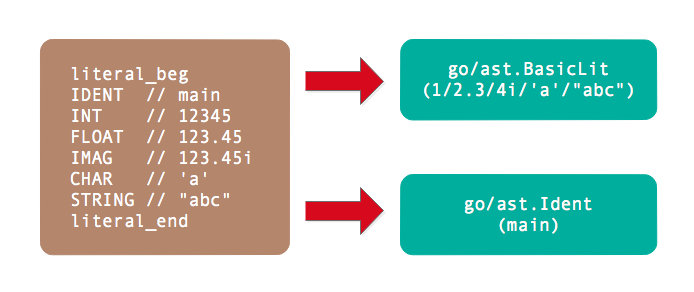

# 第2章 基础面值

面值是在程序代码中直接表示的值，其它的非零初始值只能由面值常量或常量表达式生成。比如表达式`x+2*y`的`2`就是面值，而`x`和`y`则不是面值而是标识符。Go语言规范明确定义了基础面值只有整数、浮点数、复数、符文和字符串几种类型。需要特别注意的是布尔类型的true和false并不是普通的面值，而是内置的布尔类型标识符（可能被重新定义为其它变量）。但是从Go语言用户角度看，true和false也是预定义的面值类型，因此普通的标识符也被归在面值一类（在`literal_beg`和`literal_end`之间）。

## 2.1 基础面值定义

基础面值有整数、浮点数、复数、字符和字符串几种类型，同时标识符也作为面值类型。在`go/token`包中，基础面值也被定义为独立的Token：



其中没有导出的`literal_beg`和`literal_end`之间的Token都是基础面值类型。

其中整数型面值定义如下：

```
int_lit        = decimal_lit | binary_lit | octal_lit | hex_lit .
decimal_lit    = "0" | ( "1" … "9" ) [ [ "_" ] decimal_digits ] .
binary_lit     = "0" ( "b" | "B" ) [ "_" ] binary_digits .
octal_lit      = "0" [ "o" | "O" ] [ "_" ] octal_digits .
hex_lit        = "0" ( "x" | "X" ) [ "_" ] hex_digits .
```

整数型面值分为十进制面值、二进制面值、八进制面值和十六进制面值四种形式。需要注意的是整数型面值并不支持科学计数法形式，同时数字中间可以添加下划线分隔数字。

数值类型的面值中除了整数之外就是浮点数面值。浮点数面值又分为十进制浮点数和十六进制浮点数，它们的语法定义如下：

```
float_lit         = decimal_float_lit | hex_float_lit .

decimal_float_lit = decimal_digits "." [ decimal_digits ] [ decimal_exponent ] |
                    decimal_digits decimal_exponent |
                    "." decimal_digits [ decimal_exponent ] .
decimal_exponent  = ( "e" | "E" ) [ "+" | "-" ] decimal_digits .

hex_float_lit     = "0" ( "x" | "X" ) hex_mantissa hex_exponent .
hex_mantissa      = [ "_" ] hex_digits "." [ hex_digits ] |
                    [ "_" ] hex_digits |
                    "." hex_digits .
hex_exponent      = ( "p" | "P" ) [ "+" | "-" ] decimal_digits .
```

其中decimal_float_lit表示十进制浮点数，又有普通十进制和科学计数法两种表示形式。而科学计数法形式的面值中不仅仅有十进制形式，还有十六进制科学计数法形式。十六进制浮点数在C语言的C99标准就已经存在，而C++的C++17版本开始支持，Java等语言也已经支持，而Go语言是在Go1.13开始支持。十六进制浮点数的优势是可以完美配合IEEE754定义的二进制指数的浮点数表达，可以尽量包装浮点数面值和浮点数变量的值精确一致。

除了整数和浮点数之外，数值型面值还包含复数类型：

```
imaginary_lit = (decimal_digits | int_lit | float_lit) "i" .
```

复数面值的定义比较简单，它是在整数或浮点数面值增加一个`i`后缀。比如`0i`和`123i`就分别将0和123转为复数形式。

除了数值型面值之外，还有字符面值和字符串面值，它们的定义如下：

```
rune_lit         = "'" ( unicode_value | byte_value ) "'" .
unicode_value    = unicode_char | little_u_value | big_u_value | escaped_char .
byte_value       = octal_byte_value | hex_byte_value .

string_lit             = raw_string_lit | interpreted_string_lit .
raw_string_lit         = "`" { unicode_char | newline } "`" .
interpreted_string_lit = `"` { unicode_value | byte_value } `"`
```

字符面值类似一个只有一个字符的字符串，由一对单引号包含。而字符串由一对双引号或反引号表示，其中可以包含多个字符，但是不能跨行。普通的字符和字符串都可以通过转义字符包含特殊的符号，它们是通过一个特殊的`\`斜杠开始。而反引号表示的字符串表示原生字符串，原生字符串可以跨域多行但是不支持转义字符，因此其内部是无法表示反引号这个字符的。


## 2.2 基础面值语法树结构

Go语言的抽象语法树由`go/ast`包定义。其中`ast.BasicLit`表示一个基础类型的面值常量结构，它的定义如下：

```go
type BasicLit struct {
	ValuePos token.Pos   // literal position
	Kind     token.Token // token.INT, token.FLOAT, token.IMAG, token.CHAR, or token.STRING
	Value    string      // literal string; e.g. 42, 0x7f, 3.14, 1e-9, 2.4i, 'a', '\x7f', "foo" or `\m\n\o`
}
```

其中ValuePos成员表示该词法元素开始的字节偏移量（并不包含文件名、行号和列号等信息），Kind表示面值的类型（只有数值类型、字符和字符串三类），最后的Value是表示面值的原始代码。

## 2.3 构造面值

在了解了基础面值的语法树结构之后，我们可以手工构造简单的基础面值。比如下面的代码构造一个整数9527的面值：

```go
package main

import (
	"go/ast"
	"go/token"
)

func main() {
	var lit9527 = &ast.BasicLit{
		Kind:  token.INT,
		Value: "9527",
	}
	ast.Print(nil, lit9527)
}
```

其中`token.INT`表示基础面值的类型是整数，值是整数的十进制字符串表示。如果把`token.INT`改为`token.FLOAT`则变成浮点数的9527，如果改成`token.STRING`则会变成“9527”字符串面值。

## 2.4 解析基础面值

在前面的例子中，我们通过`ast.BasicLit`结构直接构造了面值。通过手工的方式直接构造`ast.BasicLit`甚至是完整的语法树都是可以的，从理论上说可以为任何Go语言程序手工构造等价的语法树结构。但是纯手工方式构造语法树毕竟太繁琐，还好Go语言的`go/parser`可以帮我们解析Go语言代码并自动构造语法树。

下面的例子是通过`parser.ParseExpr`函数从十进制的9527生成`ast.BasicLit`结构：

```go
func main() {
	expr, _ := parser.ParseExpr(`9527`)
	ast.Print(nil, expr)
}
```

`go/parser`包提供了`parser.ParseExpr`函数用于简化表达式的解析。返回`ast.Expr`类型的`expr`和一个错误，`expr`表示表达式的语法树。然后通过`go/ast`包提供的`ast.Print`函数打印语法树。

输出结果如下：

```go
0  *ast.BasicLit {
1  .  ValuePos: 1
2  .  Kind: INT
3  .  Value: "9527"
4  }
```

也可以解析“9527”字符串面值：

```go
func main() {
	expr, _ := parser.ParseExpr(`"9527"`)
	ast.Print(nil, expr)
}
```

输出的字符串面值的原始表达文本：

```go
0  *ast.BasicLit {
1  .  ValuePos: 1
2  .  Kind: STRING
3  .  Value: "\"9527\""
4  }
```

基础面值在语法树中是属于叶子结点的存在，在递归遍历语法树时遇到基础面值结点递归就会返回。同时，通过基础面值、指针、结构体、数组和map等其它语法结构的相互嵌套和组合就可以构造出无穷无尽的复杂类型来。

## 2.5 标识符面值

`go/ast`包同样定义了Ident结构体，表示标识符类型：

```go
type Ident struct {
	NamePos token.Pos // identifier position
	Name    string    // identifier name
	Obj     *Object   // denoted object; or nil
}
```

NamePos表示标识符的位置，Name是标识符的名字，Obj则表示标识符的类型获取其它的扩展信息。作为内置的标识符面值来说，我们主要关注标识符的名字即可。

`go/ast`包同时提供了`NewIdent`函数用于创建简单的标识符：

```go
func main() {
	ast.Print(nil, ast.NewIdent(`x`))
}
```

输出的结果如下：

```
0  *ast.Ident {
1  .  NamePos: 0
2  .  Name: "x"
3  }
```

如果是从表达式解析标识符，则会通过Obj成员描述标识符额外的信息：

```go
func main() {
	expr, _ := parser.ParseExpr(`x`)
	ast.Print(nil, expr)
}
```

输出表达式中x标识符信息如下：

```go
0  *ast.Ident {
1  .  NamePos: 1
2  .  Name: "x"
3  .  Obj: *ast.Object {
4  .  .  Kind: bad
5  .  .  Name: ""
6  .  }
7  }
```

`ast.Object`是一个相对复杂的结构，其中Kind用于描述标识符的类型：

```go
const (
    Bad ObjKind = iota // for error handling
    Pkg                // package
    Con                // constant
    Typ                // type
    Var                // variable
    Fun                // function or method
    Lbl                // label
)
```

Bad表示未知的类型，其它的分别对应Go语言中包、常量、类型、变量、函数和标号等语法结构。而对于标识符中更具体的类型（比如是整数还是布尔类型）则是由`ast.Object`的其它成员描述。
