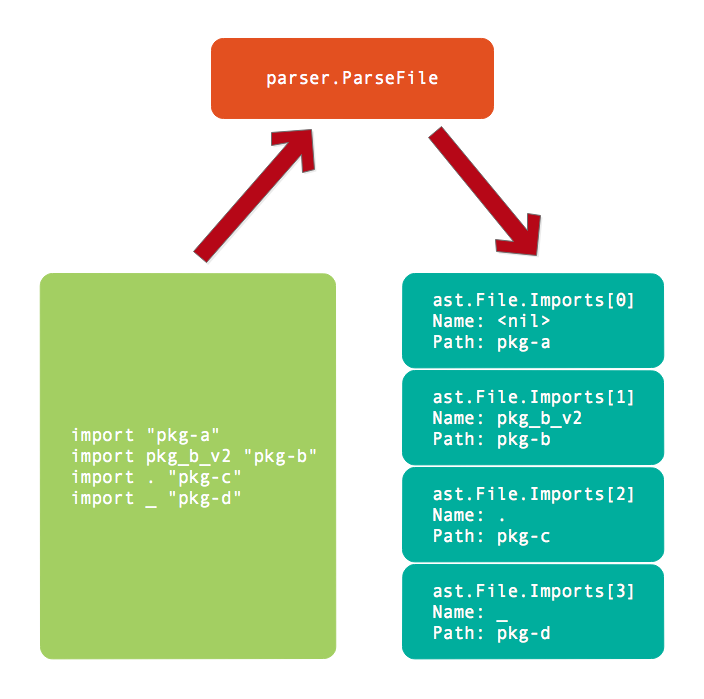
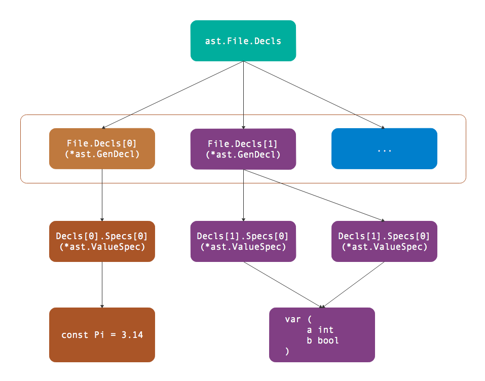

# 第5章 通用声明

通用声明是不含函数声明的包级别声明：包含导入包、类型、常量和变量四种声明。本章我们将讨论通用声明在语法树中的表示形式。

## 5.1 导入声明

Go语言中，当package关键字成功定义一个包之后，导入语句必须在第一时间出现，然后才能是类型、常量、变量和函数等其它声明。导入包的语法如下：

```
ImportDecl  = "import" ( ImportSpec | "(" { ImportSpec ";" } ")" ) .
ImportSpec  = [ "." | PackageName ] ImportPath .
ImportPath  = string_lit .

PackageName = identifier .
```

ImportDecl定义了导入声明的完整语法，第一个出现的必须是import关键字。然后小括弧中是imprt语句之后的部分，小括弧中的竖线分隔符表示只选择其中一个（和正则表达式的语法类似），这里是`ImportSpec`（单独导入一个包）或者是`"(" { ImportSpec ";" } ")"`（按组导入包）两种形式之一。ImportSpec定义了一个包的导入方式，中括弧中的导入名字是可选择的部分，ImportPath是由字符串面值组成的导入包路径。

根据导入语法定义，创建的导入声明有以下几种形式：

```go
import "pkg-a"
import pkg_b_v2 "pkg-b"
import . "pkg-c"
import _ "pkg-d"
```

其中第一种是默认的导入方式，导入后的名字采用的是"pkg-a"包定义的名字（具体的名字由依赖包决定）。第二种是将导入的"pkg-b"重新命名为pkg_b_v2。第三种是将依赖包的公开符号直接导入到当前文件的名字空间。第四种只是导入依赖包触发其包的初始化动作，但是不导入任何符号到当前文件名字空间。导入包的名字只在当前文件空间有效，因此pkg_b_v2这个名字不会扩散到当前包的其它源文件。

以下代码是对导入声明的解析：

```go
func main() {
	fset := token.NewFileSet()
	f, err := parser.ParseFile(fset, "hello.go", src, parser.ImportsOnly)
	if err != nil {
		log.Fatal(err)
	}

	for _, s := range f.Imports {
		fmt.Printf("import: name = %v, path = %#v\n", s.Name, s.Path)
	}
}

const src = `package foo
import "pkg-a"
import pkg_b_v2 "pkg-b"
import . "pkg-c"
import _ "pkg-d"
`
```

在使用`parser.ParseFile`分析文件时，采用的是`parser.ImportsOnly`模式，这样语法分析只会解析包声明和导入包的部分，其后的类型、常量、变量和函数的声明则不会解析。然后通过`ast.File`的Imports成员获取详细的导入信息（Imports成员是根据Decls声明列表中的信息生成）。

以上程序的输出结果如下：

```
import: name = <nil>, path = &ast.BasicLit{ValuePos:20, Kind:9, Value:"\"pkg-a\""}
import: name = pkg_b_v2, path = &ast.BasicLit{ValuePos:44, Kind:9, Value:"\"pkg-b\""}
import: name = ., path = &ast.BasicLit{ValuePos:61, Kind:9, Value:"\"pkg-c\""}
import: name = _, path = &ast.BasicLit{ValuePos:78, Kind:9, Value:"\"pkg-d\""}
```

其中第一个导入语句的Name是`<nil>`，表示采用的是依赖包的名字。其后的三个导入语句的Name都和我们导入声明指定的名字一致。关于导入包内部各种对象详细的定义则需要通过加载依赖的包才能获取，而内置的一些函数则需要通过手工方式和编译工具配合。

导入语句解析之后的语法树结构如图所示：



在编译完整的程序时，我们就可以根据导入包的路径加载其信息，通过导入后的Name访问依赖包中导出的符号。

## 5.2 基础类型声明

Go语言中通过type关键字声明类型：一种是声明新的类型，另一种是为已有的类型创建一个别名。以下是类型声明的语法规范：

```
TypeDecl = "type" ( TypeSpec | "(" { TypeSpec ";" } ")" ) .
TypeSpec = AliasDecl | TypeDef .

AliasDecl = identifier "=" Type .
TypeDef   = identifier Type .
Type      = identifier | "(" Type ")" .
```

其中TypeDecl定义了类型声明的语法规范，可以是每个类型独立定义或通过小括弧包含按组定义。其中AliasDecl是定义类型的别名（名字和类型中间有个赋值符号），而TypeDef则是定义一个新的类型。而基础的Type就是由标识符或者是小括弧包含的其它类型表示。

以下代码定义了一个新的MyInt1类型，同时为int创建一个MyInt2的别名：

```go
type MyInt1 int
type MyInt2 = int
```

然后通过以下代码解析以上两个类型声明语句：

```go
func main() {
	fset := token.NewFileSet()
	f, err := parser.ParseFile(fset, "hello.go", src, parser.AllErrors)
	if err != nil {
		log.Fatal(err)
	}
	...
}

const src = `package foo
type MyInt1 int
type MyInt2 = int
`
```

返回的所有声明都在`f.Decls`列表中，而基础声明对应的是`*ast.GenDecl`类型。然后我们就可以通过以下代码，查看针对类型声明的`*ast.GenDecl.Specs`列表中每个元素的类型：

```go
	for _, decl := range f.Decls {
		if v, ok := decl.(*ast.GenDecl); ok {
			for _, spec := range v.Specs {
				fmt.Printf("%T\n", spec)
			}
		}
	}
	// Output:
	// *ast.TypeSpec
	// *ast.TypeSpec
```

经过运行测试，输出的是`*ast.TypeSpec`，对于类型声明在语法树的结点类型。`*ast.TypeSpec`的结构体定义如下：

```go
type TypeSpec struct {
	Doc     *CommentGroup // associated documentation; or nil
	Name    *Ident        // type name
	Assign  token.Pos     // position of '=', if any
	Type    Expr          // *Ident, *ParenExpr, *SelectorExpr, *StarExpr, or any of the *XxxTypes
	Comment *CommentGroup // line comments; or nil
}
```

其中最重要的是`TypeSpec.Name`成员，表示新声明类型的名字或者是已有类型的别名。而`TypeSpec.Assign`成员对应`=`符号的位置，如果该成员表示的位置有效，则表示这是为已有类型定义一个别名（而不是定义新的类型）。最后`TypeSpec.Type`表示具体的类型的表达式，标识符表达式、小括号表达式、点号选择表达式、指针表达式和类似`*ast.XxxTypes`类型，目前我们展示的是最简单的标识符表示的类型。


## 5.3 常量声明

Go语言中常量属于编译时常量，只有布尔型、数值型和字符串三种常量类型，同时常量有分为弱类型和强类型常量。常量声明的语法规范如下：

```
ConstDecl      = "const" ( ConstSpec | "(" { ConstSpec ";" } ")" ) .
ConstSpec      = IdentifierList [ [ Type ] "=" ExpressionList ] .

IdentifierList = identifier { "," identifier } .
ExpressionList = Expression { "," Expression } .
```

ConstDecl定义了常量声明的语法，同样可以单独声明每个常量也可以小括弧包含按组声明常量。每个常量可以明确指定运行时类型，也可以由初始化表达式推导出常量的类型。

以下代码展示了Pi和E两个数值型常量：

```go
const Pi = 3.14
const E float64 = 2.71828
```

其中Pi被定义为弱类型的浮点数常量，可以赋值给float32或float64为基础其它变量。而E是被定义为float64的强类型常量，默认只能非接受float64类型的变量赋值。

常量声明和导入声明一样同属`*ast.GenDecl`类型的通用声明，它们的区别依然是在`ast.GenDecl.Specs`部分。我们可以使用同样的代码查看常量声明语句中Specs中元素的类型：

```go
	for _, decl := range f.Decls {
		if v, ok := decl.(*ast.GenDecl); ok {
			for _, spec := range v.Specs {
				fmt.Printf("%T\n", spec)
			}
		}
	}
	// Output:
	// *ast.ValueSpec
	// *ast.ValueSpec
```

这次输出的是`*ast.ValueSpec`类型，该类型的结构体定义如下：

```go
type ValueSpec struct {
	Doc     *CommentGroup // associated documentation; or nil
	Names   []*Ident      // value names (len(Names) > 0)
	Type    Expr          // value type; or nil
	Values  []Expr        // initial values; or nil
	Comment *CommentGroup // line comments; or nil
}
```

因为Go语言支持多赋值语法，因此其中Names和Values分别表示常量的名字和值列表。而Type部分则用于区分常量是否指定了强类型（比如例子中的E被定义为float64类型）。可以通过`ast.Print(nil, spec)`输出每个常量的语法树结构：

```
 0  *ast.ValueSpec {
 1  .  Names: []*ast.Ident (len = 1) {
 2  .  .  0: *ast.Ident {
 3  .  .  .  NamePos: 19
 4  .  .  .  Name: "Pi"
 5  .  .  .  Obj: *ast.Object {
 6  .  .  .  .  Kind: const
 7  .  .  .  .  Name: "Pi"
 8  .  .  .  .  Decl: *(obj @ 0)
 9  .  .  .  .  Data: 0
10  .  .  .  }
11  .  .  }
12  .  }
13  .  Values: []ast.Expr (len = 1) {
14  .  .  0: *ast.BasicLit {
15  .  .  .  ValuePos: 24
16  .  .  .  Kind: FLOAT
17  .  .  .  Value: "3.14"
18  .  .  }
19  .  }
20  }
 0  *ast.ValueSpec {
 1  .  Names: []*ast.Ident (len = 1) {
 2  .  .  0: *ast.Ident {
 3  .  .  .  NamePos: 35
 4  .  .  .  Name: "E"
 5  .  .  .  Obj: *ast.Object {
 6  .  .  .  .  Kind: const
 7  .  .  .  .  Name: "E"
 8  .  .  .  .  Decl: *(obj @ 0)
 9  .  .  .  .  Data: 0
10  .  .  .  }
11  .  .  }
12  .  }
13  .  Type: *ast.Ident {
14  .  .  NamePos: 37
15  .  .  Name: "float64"
16  .  }
17  .  Values: []ast.Expr (len = 1) {
18  .  .  0: *ast.BasicLit {
19  .  .  .  ValuePos: 47
20  .  .  .  Kind: FLOAT
21  .  .  .  Value: "2.71828"
22  .  .  }
23  .  }
24  }
```

可以发现`*ast.ValueSpec`中Names部分输出的就是普通的`*ast.Ident`标识符类型，其中包含常量的名字。而Values部分输出的是`*ast.BasicLit`是基础的面值常量。比较特殊的是E常量对应的`*ast.ValueSpec`中携带了Type信息，这里是通过`*ast.Ident`类型表示常量被指定为`float64`类型。

## 5.4 变量声明

变量声明的语法规范和常量声明几乎是一样的，只是开始的var关键字不同而已。变量声明的语法规范如下：

```
VarDecl = "var" ( VarSpec | "(" { VarSpec ";" } ")" ) .
VarSpec = IdentifierList [ [ Type ] "=" ExpressionList ] .

IdentifierList = identifier { "," identifier } .
ExpressionList = Expression { "," Expression } .
```

变量的声明和常量的声明有着相同的结构，在语法树中可以根据`*ast.GenDecl`结构中的Tok区别它们。其实根据`*ast.GenDecl`结构中的Tok可以区分所有的基本声明，包含导入声明、类型声明、常量和变量声明。

下面是构建变量声明语法树的例子：

```go
func main() {
	fset := token.NewFileSet()
	f, err := parser.ParseFile(fset, "hello.go", src, parser.AllErrors)
	if err != nil {
		log.Fatal(err)
	}
	for _, decl := range f.Decls {
		if v, ok := decl.(*ast.GenDecl); ok {
			fmt.Printf("token: %v\n", v.Tok)
			for _, spec := range v.Specs {
				ast.Print(nil, spec)
			}
		}
	}
}

const src = `package foo
var Pi = 3.14
`
```

输出的结果如下：

```
token: var
 0  *ast.ValueSpec {
 1  .  Names: []*ast.Ident (len = 1) {
 2  .  .  0: *ast.Ident {
 3  .  .  .  NamePos: 17
 4  .  .  .  Name: "Pi"
 5  .  .  .  Obj: *ast.Object {
 6  .  .  .  .  Kind: var
 7  .  .  .  .  Name: "Pi"
 8  .  .  .  .  Decl: *(obj @ 0)
 9  .  .  .  .  Data: 0
10  .  .  .  }
11  .  .  }
12  .  }
13  .  Values: []ast.Expr (len = 1) {
14  .  .  0: *ast.BasicLit {
15  .  .  .  ValuePos: 22
16  .  .  .  Kind: FLOAT
17  .  .  .  Value: "3.14"
18  .  .  }
19  .  }
20  }
```

首先输出的Tok值为`var`，表示这是一个变量声明。变量的名字和类型通过`*ast.ValueSpec`结构表示。

## 5.5 按组声明

支持按组声明的语法有着类似以下的语法结构：

```bnf
XxxDecl = "xxx" ( XxxSpec | "(" { XxxSpec ";" } ")" ) .
XxxSpec = ...
```

其中xxx表示声明开头的关键字，基础声明部分的导入声明、类型声明、常量和变量声明都支持按组声明的方式。但是函数的声明是不支持按组的方式的，因此声明部分将函数的声明从基础声明独立出来处理。

以下是例子定义了一个常量和两个变量，其中常量是独立声明，两个变量是按组声明：

```go
const Pi = 3.14

var (
	a int
	b bool
)
```

以上代码对应语法树的逻辑结构如图所示：



因为第一个出现的是`const`关键字，因此`*ast.File.Decls`的第一个元素是表示常量的`*ast.GenDecl`类型，其中Specs列表只有一个元素对应Pi常量。第二个出现是`var`关键字，因此`*ast.File.Decls`的第二个元素是表示变量的`*ast.GenDecl`类型，其中Specs列表有两个元素分别对应a和b两个变量，Specs列表的长度对应组声明中元素的个数。

