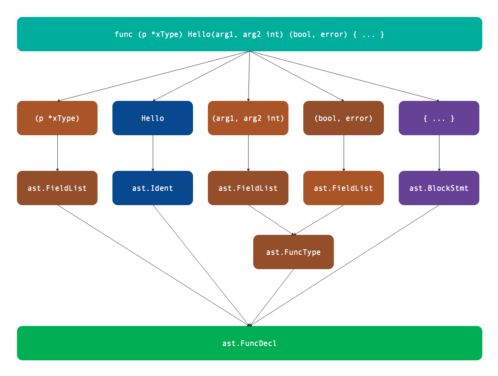

# 第6章 函数声明

函数是所有编程语言中的核心，因为只有函数的语句才有了计算的功能。Go语言的函数也是一种值数据，可以定义包级别的函数，也可以为自定义的类型定义方法，同时还可以在局部作用域内定义闭包函数。本节将讨论函数的数据类型。

## 6.1 函数的语法

在顶级声明中包含函数和方法的声明，从语法角度看函数是没有接收者参数的方法特例。函数的语法规则如下：

```
FunctionDecl = "func" MethodName Signature [ FunctionBody ] .
MethodDecl   = "func" Receiver MethodName Signature [ FunctionBody ] .

MethodName     = identifier .
Receiver       = Parameters .
Signature      = Parameters [ Result ] .
Result         = Parameters | Type .
Parameters     = "(" [ ParameterList [ "," ] ] ")" .
ParameterList  = ParameterDecl { "," ParameterDecl } .
ParameterDecl  = [ IdentifierList ] [ "..." ] Type .
```

其中FunctionDecl表示函数，而MethodDecl表示方法。MethodDecl表示的方法规范比函数多了Receiver语法结构，Receiver表示方法的接收者参数。然后是MethodName表示的函数或方法名，Signature表示函数的签名（或者叫类型），最后是函数的主体。需要注意的是函数的签名只有输入参数和返回值部分，因此函数或方法的名字、以及方法的接收者类型都不是函数签名的组成部分。从以上定义还可以发现，Receiver、Parameters和Result都是ParameterList定义，因此有着相同的语法结构（在语法树中也是有着相同的结构）。

## 6.2 定义函数

包一级的函数只有包函数和方法两种类型（闭包函数只能在函数体内部创建），而包函数可以看作是没有接收者的方法函数。因此只有搞明白方法函数的类型，全局的包函数自然就清楚了。

下面是一个方法函数：

```go
func (p *xType) Hello(arg1, arg2 int) (bool, error) { ... }
```

通过`parser.ParseFile`解析得到`*ast.File`类型的f返回值之后，可以通过以下的代码打印方法的声明：

```go
	for _, decl := range f.Decls {
		if fn, ok := decl.(*ast.FuncDecl); ok {
			ast.Print(nil, fn)
		}
	}
```

函数的声明对应`*ast.FuncDecl`类型，它的定义如下：

```go
type FuncDecl struct {
	Doc  *CommentGroup // associated documentation; or nil
	Recv *FieldList    // receiver (methods); or nil (functions)
	Name *Ident        // function/method name
	Type *FuncType     // function signature: parameters, results, and position of "func" keyword
	Body *BlockStmt    // function body; or nil for external (non-Go) function
}
```

其中Recv对应接收者列表，在这里是指`(p *xType)`部分。Name是函数的名字，这里的名字是Hello。而Type表示方法或函数的类型（函数的类型和接口的定义一致，因为接口并不包含接收者信息），其中包含输入参数和返回值信息。最后的Body表示函数体中的语句部分，我们暂时忽略函数体部分。

函数声明最重要的是名字、接收者、输入参数和返回值，其中除名字之外的三者都是`ast.FieldList`类型，而输入参数和返回值又被封装为`ast.FuncType`类型。表示函数类型的`ast.FuncType`结构体定义如下：

```go
type FuncType struct {
	Func    token.Pos  // position of "func" keyword (token.NoPos if there is no "func")
	Params  *FieldList // (incoming) parameters; non-nil
	Results *FieldList // (outgoing) results; or nil
}
```

其中Params和Results分别表示输入参数和返回值列表，它们和函数的接收者参数列表是相同的类型。因此该方法的定义可以用下图表示：



对于没有接受者的包函数，`ast.FuncDecl.Recv`部分为nil。而对于方法函数，即使定义多个接收者参数依然是可以正确解析的。因此合法的语法树不一定完全满足Go语言的规范，一般在语法树构建完成之后还需要专门进行语义分析。

## 6.3 参数分组

接收者、输入和返回值参数均由`ast.FieldList`定义，该结构体定义如下：

```go
type FieldList struct {
	Opening token.Pos // position of opening parenthesis/brace, if any
	List    []*Field  // field list; or nil
	Closing token.Pos // position of closing parenthesis/brace, if any
}
type Field struct {
	Doc     *CommentGroup // associated documentation; or nil
	Names   []*Ident      // field/method/parameter names; or nil
	Type    Expr          // field/method/parameter type
	Tag     *BasicLit     // field tag; or nil
	Comment *CommentGroup // line comments; or nil
}
```

`ast.FieldList`其实是`[]*ast.Field`切片类型的再次包装，注意是增加了开始和结束的位置信息。每一个`ast.Field`表示一组参数，所有参数的名字由`[]*ast.Ident`切片表示，而通一组参数有着相同的类型。Type表示一组参数的类型，是一个类型表达式。

查看下面的例子：

```go
func Hello1(s0, s1 string, s2 string)
```

其中s0省略了类型，和s1共享string类型，因此s0和s1是一组参数，对应一个`ast.Field`。而s2是另一个独立的`ast.Field`。

函数的接收者、输入和返回值参数均可以省略名字，如果省略了名字则使用后面第一次出现的类型。如果全部参数都省略了名字，那么每个参数就只有类型信息，函数体内部无法再通过参数名字访问参数。
